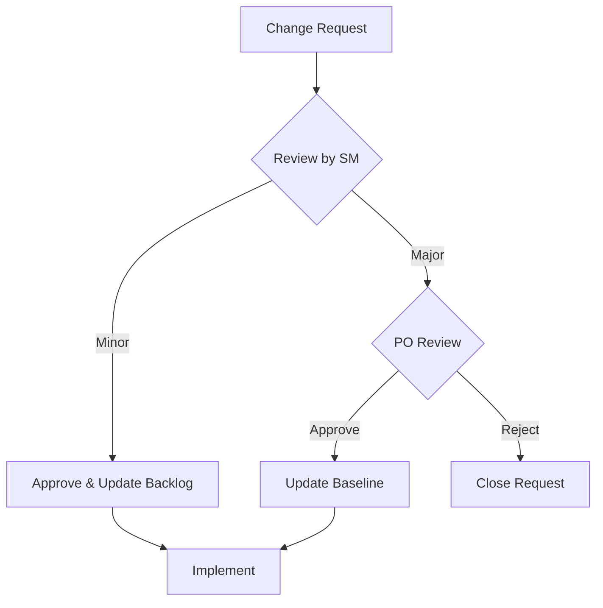

# CHANGE MANAGEMENT PLAN
## The Wandering Rose - Villa Booking System

---

## 1. MỤC ĐÍCH

Tài liệu này mô tả quy trình quản lý thay đổi trong dự án, đảm bảo mọi thay đổi được kiểm soát và không ảnh hưởng tiêu cực đến scope, schedule, cost.

---

## 2. QUY TRÌNH THAY ĐỔI



---

## 3. PHÂN LOẠI THAY ĐỔI

| Loại | Định nghĩa | Quyền phê duyệt |
|------|-----------|-----------------|
| **Minor** | Không ảnh hưởng scope/schedule (bug fixes, UI tweaks) | Scrum Master |
| **Medium** | Ảnh hưởng 1 sprint (new feature in backlog) | Product Owner |
| **Major** | Ảnh hưởng project baseline | PO + Stakeholders |

---

## 4. CHANGE REQUEST TEMPLATE

```markdown
# CHANGE REQUEST

**ID:** CR-XXX
**Ngày:** DD/MM/YYYY
**Người yêu cầu:** 

## Mô tả thay đổi
[Mô tả chi tiết]

## Lý do
[Tại sao cần thay đổi]

## Impact Assessment
- [ ] Scope
- [ ] Schedule  
- [ ] Cost
- [ ] Quality

## Ước tính effort
[Story points hoặc hours]

## Phê duyệt
- [ ] SM Approved
- [ ] PO Approved
```

---

## 5. CHANGE LOG

| CR ID | Ngày | Mô tả | Impact | Status |
|-------|------|-------|--------|--------|
| CR-001 | - | - | - | - |

---

## 6. NGUYÊN TẮC

1. **No changes during Sprint** - Không thêm scope trong Sprint đang chạy
2. **Impact first** - Đánh giá impact trước khi approve
3. **Document everything** - Mọi thay đổi phải được ghi lại
4. **Communicate** - Thông báo cho team sau khi approve

---

*Phiên bản: 1.0 | Ngày tạo: 19/12/2025*
