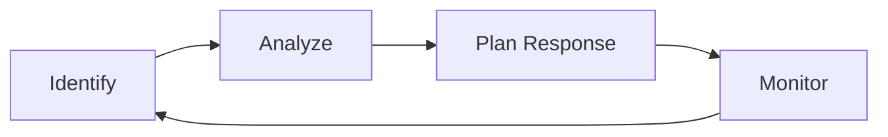

# RISK MANAGEMENT PLAN
## The Wandering Rose - Villa Booking System

---

## 1. MỤC ĐÍCH

Tài liệu này mô tả quy trình quản lý rủi ro dự án, bao gồm:
- Cách xác định rủi ro
- Cách đánh giá và phân loại rủi ro
- Cách lập kế hoạch ứng phó
- Cách theo dõi rủi ro

---

## 2. QUY TRÌNH QUẢN LÝ RỦI RO



### 2.1 Xác định rủi ro (Identify)
- **Phương pháp:** Brainstorming, Checklist, Expert judgment
- **Thời điểm:** Sprint Planning, Daily Standup
- **Nguồn:** Team members, Past projects, Technical analysis

### 2.2 Phân tích rủi ro (Analyze)
- **Đánh giá Probability:** Low (1), Medium (2), High (3)
- **Đánh giá Impact:** Low (1), Medium (2), High (3)
- **Risk Score = Probability × Impact**

### 2.3 Lập kế hoạch ứng phó (Plan Response)
| Strategy | Áp dụng khi |
|----------|-------------|
| **Avoid** | Thay đổi kế hoạch để loại bỏ rủi ro |
| **Mitigate** | Giảm probability hoặc impact |
| **Transfer** | Chuyển rủi ro cho bên khác |
| **Accept** | Chấp nhận và chuẩn bị contingency |

### 2.4 Theo dõi (Monitor)
- **Frequency:** Mỗi Daily Standup
- **Tool:** Trello (Risk Register column)
- **Owner:** Scrum Master (B)

---

## 3. RISK MATRIX

```
          │  Low Impact  │ Med Impact │ High Impact │
          │     (1)      │    (2)     │     (3)     │
──────────┼──────────────┼────────────┼─────────────┤
High (3)  │   Medium     │    High    │  Critical   │
──────────┼──────────────┼────────────┼─────────────┤
Med (2)   │    Low       │   Medium   │    High     │
──────────┼──────────────┼────────────┼─────────────┤
Low (1)   │   Very Low   │    Low     │   Medium    │
──────────┴──────────────┴────────────┴─────────────┘
```

### Risk Score Interpretation
| Score | Level | Action |
|-------|-------|--------|
| 1-2 | Very Low / Low | Monitor |
| 3-4 | Medium | Mitigation plan |
| 6 | High | Immediate action |
| 9 | Critical | Escalate to PO |

---

## 4. RISK CATEGORIES

| Category | Ví dụ |
|----------|-------|
| **Technical** | Technology fails, bugs, integration issues |
| **Schedule** | Delays, wrong estimates |
| **Resource** | Team unavailable, skill gaps |
| **External** | Requirement changes, stakeholder issues |
| **Quality** | Defects, poor UX |

---

## 5. RISK REGISTER

Xem file chi tiết: `../08_Risk_Register.md`

### Summary (10+ Risks)
| ID | Rủi ro | Score | Response |
|----|--------|-------|----------|
| R01 | Timeline quá ngắn | 6 | Mitigate |
| R02 | Thiếu kinh nghiệm Scrum | 4 | Mitigate |
| R03 | Yêu cầu thay đổi | 4 | Accept |
| R04 | Technical debt | 3 | Mitigate |
| R05 | Integration issues | 6 | Mitigate |
| R06 | Team member unavailable | 4 | Mitigate |
| R07 | Scope creep | 4 | Avoid |
| R08 | Poor code quality | 3 | Mitigate |
| R09 | Testing không đủ | 4 | Mitigate |
| R10 | Documentation thiếu | 2 | Accept |

---

## 6. ROLES & RESPONSIBILITIES

| Role | Responsibility |
|------|----------------|
| **Product Owner (A)** | Approve risk responses, Accept residual risks |
| **Scrum Master (B)** | Maintain Risk Register, Facilitate risk discussions |
| **Dev Team (C,D,E,F)** | Identify technical risks, Implement mitigations |

---

## 7. RISK REPORTING

### Format
- **Daily Standup:** Mention new risks/blockers
- **Sprint Review:** Risk summary presentation
- **Risk Register:** Update in Trello

### Escalation
| Trigger | Action |
|---------|--------|
| New High risk | Notify SM immediately |
| Risk becomes issue | Emergency meeting |
| Critical blocker | Escalate to PO |

---

*Phiên bản: 1.0 | Ngày tạo: 19/12/2025*
