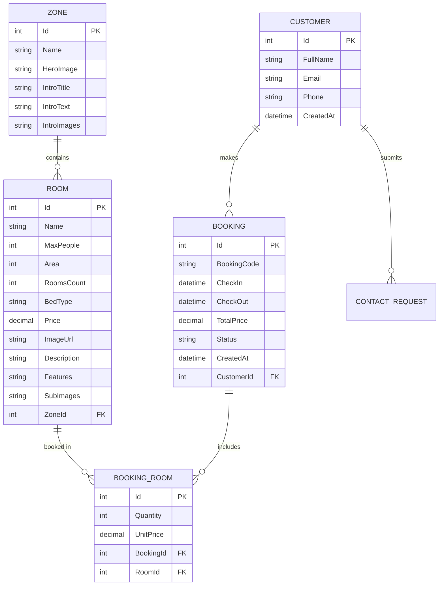

# BÁO CÁO DỰ ÁN - THE WANDERING ROSE
## Đề tài 1: Website Đặt Phòng Khu Nghỉ Dưỡng

---

## 📋 THÔNG TIN CHUNG

| Thông tin | Chi tiết |
|-----------|----------|
| **Tên dự án** | The Wandering Rose - Eco Resort Ba Vì |
| **Loại ứng dụng** | Website đặt phòng khu nghỉ dưỡng |
| **Ngày báo cáo** | 10/01/2026 |
| **Trạng thái** | Đang phát triển |

---

## 🎯 MÔ TẢ DỰ ÁN

### 1. Mục tiêu
Xây dựng website đặt phòng trực tuyến cho khu nghỉ dưỡng sinh thái "The Wandering Rose" tại Ba Vì, Hà Nội. Website cung cấp các chức năng:
- Hiển thị thông tin phòng theo từng khu vực (zone)
- Đặt phòng trực tuyến với lịch check-in/check-out
- Đặt dịch vụ sự kiện (sinh nhật, teambuilding, tiệc cưới, kỷ niệm)
- Đặt tour du lịch địa phương
- Liên hệ và hỗ trợ khách hàng
- Quản lý thông tin tin tức và FAQ

### 2. Đối tượng người dùng
- **Khách hàng**: Người muốn đặt phòng, đặt dịch vụ sự kiện hoặc tour
- **Quản trị viên** (tương lai): Quản lý booking, nội dung website

---

## 🛠️ CÔNG NGHỆ SỬ DỤNG

### Frontend
| Công nghệ | Phiên bản | Mô tả |
|-----------|-----------|-------|
| React | 19.2.3 | Thư viện xây dựng giao diện |
| TypeScript | 5.8.2 | Ngôn ngữ lập trình typed |
| Vite | 6.2.0 | Build tool và dev server |
| TailwindCSS | CDN | Framework CSS tiện ích |
| Lucide React | 0.562.0 | Thư viện icon |

### Backend
| Công nghệ | Mô tả |
|-----------|-------|
| ASP.NET Core | Web API framework |
| Entity Framework Core | ORM database |
| SQL Server 2022 | Hệ quản trị CSDL |

### DevOps
| Công nghệ | Mô tả |
|-----------|-------|
| Docker | Container hóa ứng dụng |
| Docker Compose | Orchestration multi-container |
| Nginx | Web server / Reverse proxy |

---

## 📁 CẤU TRÚC DỰ ÁN

```
the-wandering-rose/
├── 📂 backend/                    # ASP.NET Core API
│   ├── Controllers/               # API Controllers (5 files)
│   │   ├── BookingsController.cs
│   │   ├── ContentControllers.cs
│   │   ├── FormControllers.cs
│   │   ├── RoomsController.cs
│   │   └── ZonesController.cs
│   ├── DTOs/                      # Data Transfer Objects
│   ├── Data/                      # Database Context
│   ├── Migrations/                # EF Migrations
│   ├── Models/                    # Entity Models
│   │   └── Entities.cs            # 13 entity classes
│   ├── Program.cs                 # Entry point
│   └── Dockerfile
│
├── 📂 components/                 # React Components (21 files)
│   ├── HomeView.tsx               # Trang chủ
│   ├── AboutUs.tsx                # Giới thiệu
│   ├── RoomCategories.tsx         # Danh mục phòng
│   ├── RoomDetailView.tsx         # Chi tiết phòng
│   ├── ZoneDetailView.tsx         # Chi tiết khu vực
│   ├── BookingCalendar.tsx        # Lịch đặt phòng
│   ├── BookingResultView.tsx      # Kết quả tìm phòng
│   ├── CheckoutView.tsx           # Thanh toán
│   ├── PaymentView.tsx            # Xác nhận payment
│   ├── ConfirmationView.tsx       # Xác nhận booking
│   ├── ServicesEvents.tsx         # Dịch vụ sự kiện
│   ├── ServiceDetailView.tsx      # Chi tiết dịch vụ
│   ├── ExperiencesTours.tsx       # Trải nghiệm & Tour
│   ├── TourDetailView.tsx         # Chi tiết tour
│   ├── ContactUs.tsx              # Liên hệ
│   ├── FAQView.tsx                # Câu hỏi thường gặp
│   ├── GalleryView.tsx            # Thư viện ảnh
│   ├── NewsDetailView.tsx         # Chi tiết tin tức
│   ├── RoomCard.tsx               # Card phòng
│   ├── SectionTitle.tsx           # Title component
│   └── GeneralCard.tsx            # Card chung
│
├── 📂 services/                   # API Services (3 files)
│   ├── api.ts                     # API client
│   ├── mockController.ts          # Mock data controller
│   └── useApi.ts                  # Custom API hooks
│
├── 📂 document/                   # Tài liệu dự án
│   ├── ITE1140E_Software Project Management_v3.pdf
│   ├── LaravelCodingConvention_sample_v1.docx
│   └── [21][ITE1140E][DC] Quan tri du an phan mem 2022.pdf
│
├── App.tsx                        # Root component
├── types.ts                       # TypeScript types
├── constants.ts                   # Mock data & constants
├── index.html                     # HTML entry point
├── index.tsx                      # React entry point
├── docker-compose.yml             # Docker orchestration
├── nginx.conf                     # Nginx configuration
├── package.json                   # NPM dependencies
├── tsconfig.json                  # TypeScript config
└── vite.config.ts                 # Vite config
```

---

## 🗃️ MÔ HÌNH DỮ LIỆU

### Các Entity chính (13 entities)



### Các Entity hỗ trợ
| Entity | Mô tả |
|--------|-------|
| `EventService` | Dịch vụ sự kiện (sinh nhật, teambuilding...) |
| `EventBooking` | Đơn đặt dịch vụ sự kiện |
| `Tour` | Thông tin tour du lịch |
| `TourBooking` | Đơn đặt tour |
| `News` | Bài viết tin tức |
| `Faq` | Câu hỏi thường gặp |
| `Amenity` | Tiện nghi khu nghỉ |
| `ContactRequest` | Yêu cầu liên hệ |

---

## 🌐 API ENDPOINTS

### Zones API
| Method | Endpoint | Mô tả |
|--------|----------|-------|
| GET | `/api/zones` | Lấy tất cả zones |
| GET | `/api/zones/{id}` | Lấy zone theo ID |
| GET | `/api/zones/name/{name}` | Lấy zone theo tên |

### Rooms API
| Method | Endpoint | Mô tả |
|--------|----------|-------|
| GET | `/api/rooms` | Lấy tất cả phòng |
| GET | `/api/rooms?zone={zone}` | Lấy phòng theo zone |
| GET | `/api/rooms/{id}` | Lấy phòng theo ID |
| GET | `/api/rooms/available` | Tìm phòng trống |

### Bookings API
| Method | Endpoint | Mô tả |
|--------|----------|-------|
| POST | `/api/bookings` | Tạo booking mới |
| GET | `/api/bookings/{code}` | Lấy booking theo mã |
| PATCH | `/api/bookings/{code}/status` | Cập nhật trạng thái |

### Content API
| Method | Endpoint | Mô tả |
|--------|----------|-------|
| GET | `/api/tours` | Lấy danh sách tour |
| GET | `/api/events` | Lấy dịch vụ sự kiện |
| GET | `/api/news` | Lấy tin tức |
| GET | `/api/faqs` | Lấy FAQ |
| GET | `/api/amenities` | Lấy tiện nghi |

### Form Submissions API
| Method | Endpoint | Mô tả |
|--------|----------|-------|
| POST | `/api/contact` | Gửi form liên hệ |
| POST | `/api/event-bookings` | Đặt sự kiện |
| POST | `/api/tour-bookings` | Đặt tour |

---

## 🏨 DỮ LIỆU PHÒNG

### Khu vực (Zones)
| Zone | Số phòng | Đặc điểm |
|------|----------|----------|
| **Wooden House** | 3 phòng | Gỗ mộc mạc, view rừng thông |
| **Rose House** | 3 phòng | Phong cách pastel, vườn hoa hồng |
| **Villa** | 1 biệt thự | Cao cấp, hồ bơi riêng |

### Chi tiết phòng
| Phòng | Zone | Sức chứa | Diện tích | Giá/đêm |
|-------|------|----------|-----------|---------|
| Forest Room | Wooden House | 16 người | 48m² | 2,500,000₫ |
| Deluxe Room | Wooden House | 2 người | 18m² | 1,200,000₫ |
| Family Room | Wooden House | 4 người | 45m² | 1,800,000₫ |
| Pink Rose House | Rose House | 4 người | 30m² | 1,900,000₫ |
| White Rose House | Rose House | 2 người | 24m² | 1,500,000₫ |
| Red Rose House | Rose House | 2 người | 13m² | 1,300,000₫ |
| The Wandering Rose Villa | Villa | 4 người | 100m² | 5,000,000₫ |

---

## 🎉 DỊCH VỤ SỰ KIỆN

| Dịch vụ | Mô tả |
|---------|-------|
| **Tổ chức sinh nhật** | Trang trí, tiệc BBQ, âm thanh ánh sáng |
| **Teambuilding** | Sân cỏ 500m², trò chơi đa dạng, lửa trại |
| **Tiệc cưới nhỏ** | Intimate Wedding, trang trí hoa, phòng tân hôn |
| **Lễ kỷ niệm** | Không gian sang trọng, Private Chef |

---

## 🗺️ TOUR DU LỊCH

| Tour | Mô tả |
|------|-------|
| **Vườn Quốc gia Ba Vì** | Trekking, Nhà kính xương rồng, Đền Thượng |
| **Ao Vua** | Thác nước, tắm thảo dược, trò chơi |
| **Khoang Xanh - Suối Tiên** | Tắm bùn khoáng, thác nước, động trượt tuyết |
| **Trải nghiệm bản địa** | Hái chè, thăm trang trại bò sữa |

---

## 🚀 HƯỚNG DẪN TRIỂN KHAI

### Chạy Local (Development)
```bash
# 1. Cài đặt dependencies
npm install

# 2. Cấu hình API key (nếu cần)
# Chỉnh sửa file .env.local

# 3. Chạy ứng dụng
npm run dev
```

### Chạy với Docker (Production)
```bash
# Build và chạy tất cả services
docker-compose up -d

# Services sẽ chạy trên:
# - Frontend: http://localhost:80
# - Backend API: http://localhost:5000
# - Database: localhost:1433
```

---

## 📊 TIẾN ĐỘ DỰ ÁN

### Các tính năng đã hoàn thành ✅
- [x] Thiết kế giao diện React với TailwindCSS
- [x] Trang chủ với hero section và navigation
- [x] Danh mục phòng theo zone
- [x] Chi tiết phòng và chi tiết zone
- [x] Booking calendar với chọn ngày check-in/out
- [x] Flow đặt phòng hoàn chỉnh (Search → Checkout → Payment → Confirmation)
- [x] Trang dịch vụ sự kiện
- [x] Trang tour du lịch
- [x] Trang liên hệ
- [x] Trang FAQ
- [x] Backend API với ASP.NET Core
- [x] Database models và migrations
- [x] Docker containerization
- [x] Mock data controller cho development

### Các tính năng cần phát triển 🔄
- [ ] Tích hợp payment gateway thực
- [ ] Admin dashboard quản lý
- [ ] Email notification
- [ ] User authentication
- [ ] Review và đánh giá phòng
- [ ] Multi-language support

---

## 📝 GHI CHÚ PHÁT TRIỂN

1. **Mock Data**: Hiện tại frontend sử dụng mock data trong `constants.ts` và `mockController.ts` để phát triển UI. Backend API đã sẵn sàng tích hợp.

2. **API Integration**: File `services/api.ts` chứa các hàm gọi API backend. Cần cấu hình `VITE_API_URL` trong `.env.local` để sử dụng.

3. **Responsive Design**: Giao diện được thiết kế mobile-first với breakpoints TailwindCSS.

4. **Font chữ**: Sử dụng Google Fonts (Playfair Display, Lato, Pinyon Script).

---

## 👥 THÔNG TIN LIÊN HỆ DỰ ÁN

- **Địa điểm**: Thôn Mít Mái, Xã Yên Bài, Huyện Ba Vì, Hà Nội
- **Hotline**: 092 981 6699
- **Email**: booking@thewanderingrose.com

---

*Báo cáo được tạo tự động ngày 10/01/2026*
